# OFPPT Management System

<div align="center">
  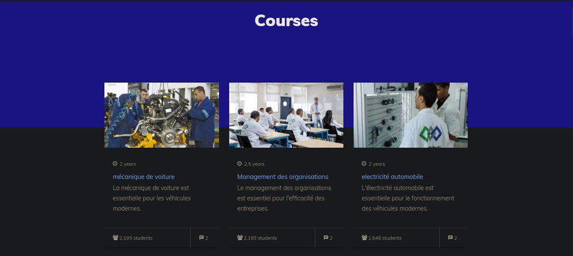
</div>

A comprehensive web-based school management system designed for OFPPT (Office de la Formation Professionnelle et de la Promotion du Travail). This system streamlines educational institution operations by facilitating communication and management between administrators, teachers, students, and parents.

## 📋 Table of Contents
- [Overview](#overview)
- [Frontend Interface](#frontend-interface)
- [Backend System](#backend-system)
- [User Roles](#user-roles)
- [Technologies Used](#technologies-used)
- [System Requirements](#system-requirements)
- [Installation](#installation)
- [Project Structure](#project-structure)
- [Testing](#testing)
- [Security](#security)
- [Contributors](#contributors)
- [Institution](#institution)
- [License](#license)

## 🔍 Overview

The OFPPT Management System is a complete solution for educational institutions to manage their administrative tasks, academic processes, and communication channels between all stakeholders. The system is built with security, scalability, and user experience in mind.

## 🖥️ Frontend Interface

### Landing Page
<div align="center">
  
</div>

### Login Interface
<div align="center">
  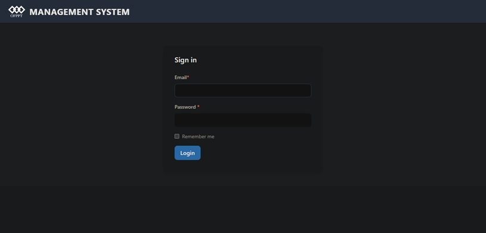
</div>

### Frontend Features
- Modern, responsive design
- Intuitive navigation
- Role-based user interfaces
- Accessible from any device
- Interactive dashboards

## ⚙️ Backend System

### Administrator Dashboard
<div align="center">
  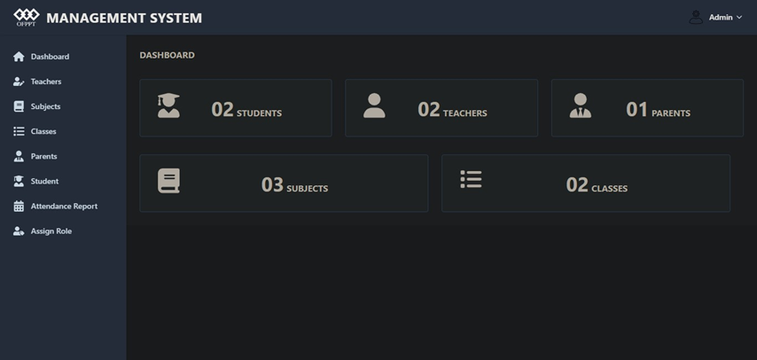
</div>

### Role Management
<div align="center">
  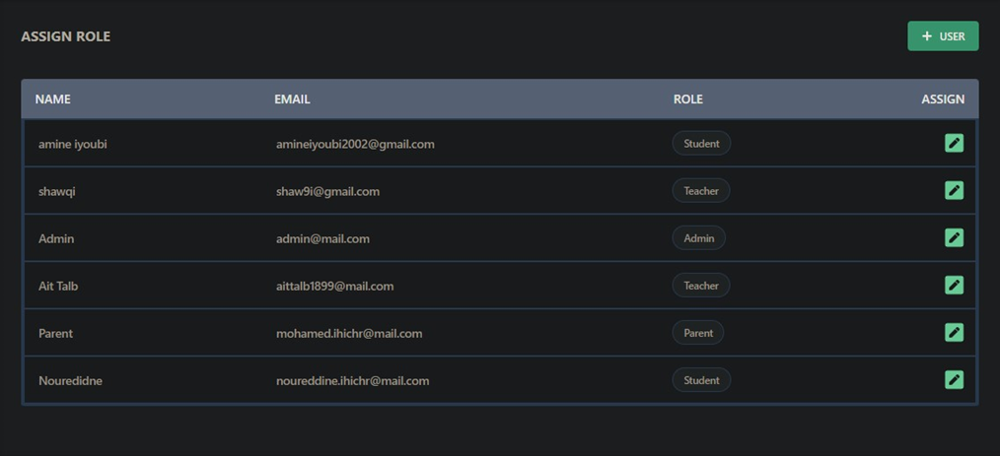
</div>

### Backend Features

#### Administrator Modules
- **User Management**
  <div align="center">
    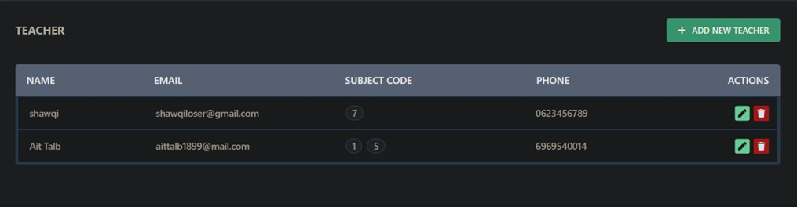
    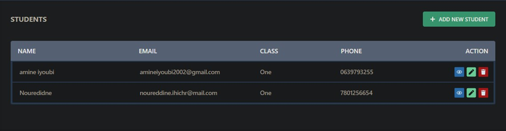
    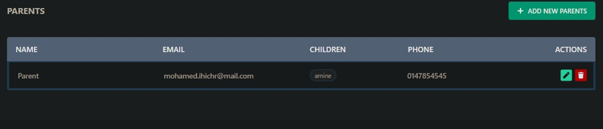
  </div>
  
- **Academic Management**
  <div align="center">
    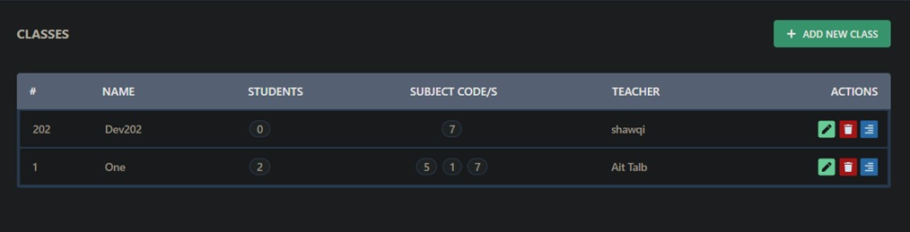
    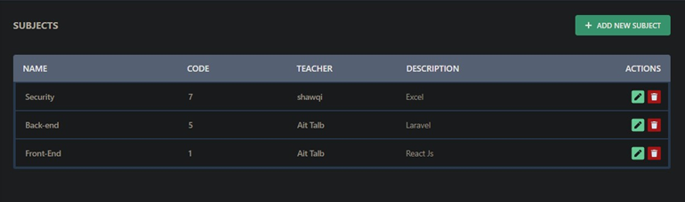
  </div>
  
- **Attendance System**
  <div align="center">
    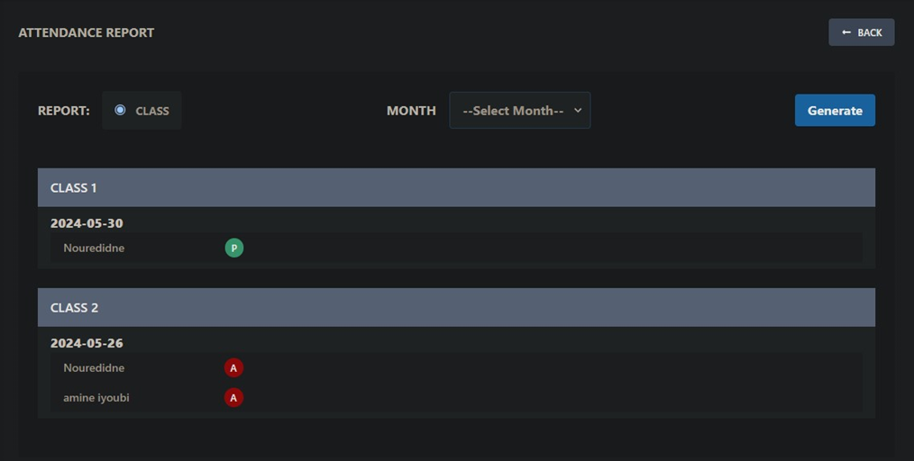
  </div>
  
- **Profile Management**
  <div align="center">
    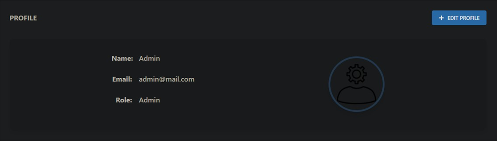
  </div>

## 👥 User Roles

### Teacher Interface
<div align="center">
  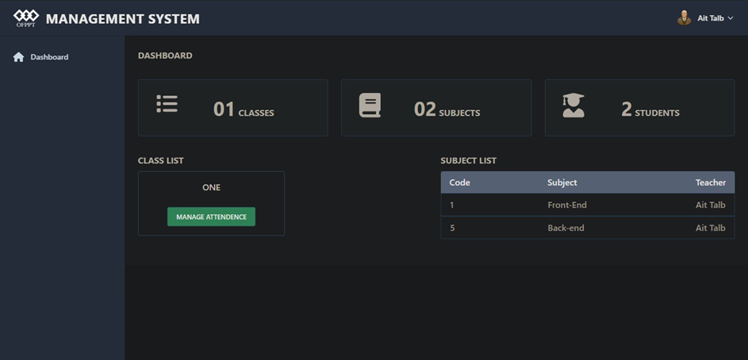
  <p>Teacher Dashboard</p>
  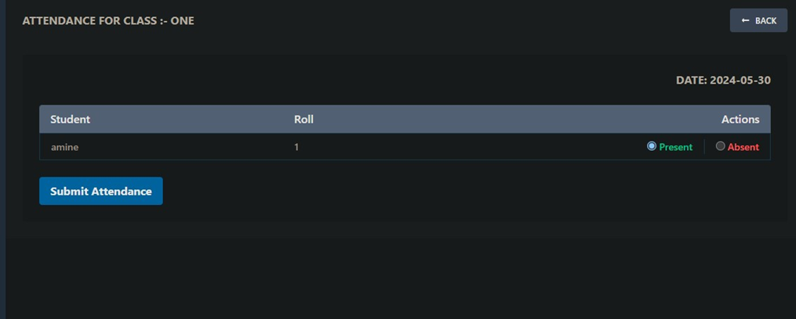
  <p>Attendance Management</p>
  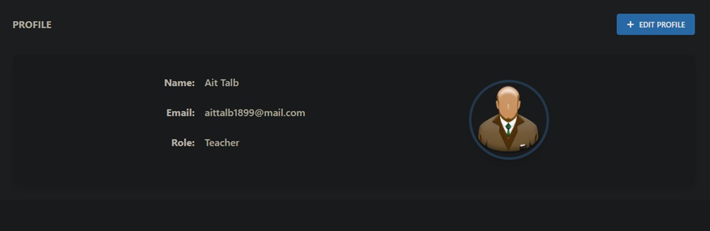
  <p>Teacher Profile</p>
</div>

### Student Interface
<div align="center">
  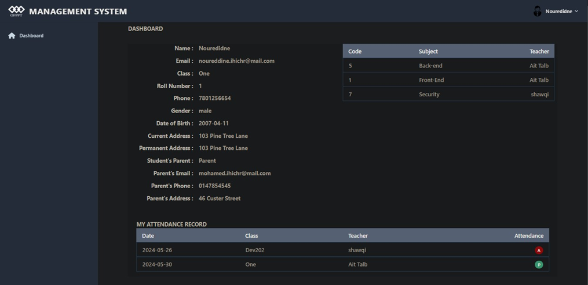
  <p>Student Dashboard</p>
  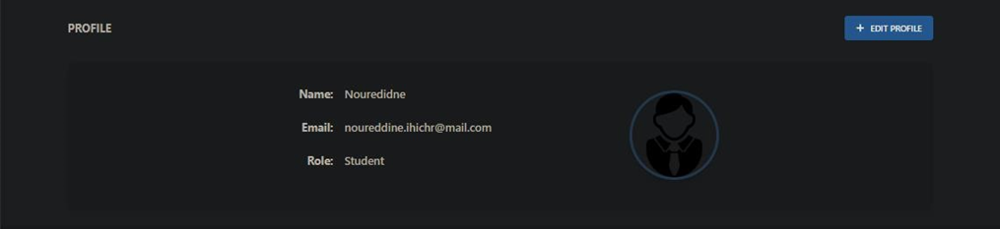
  <p>Student Profile</p>
</div>

### Parent Interface
<div align="center">
  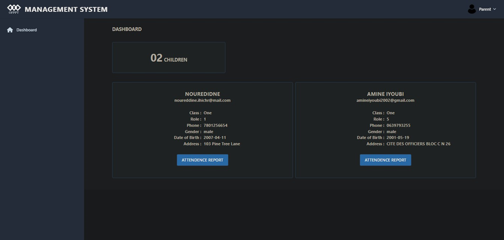
  <p>Parent Dashboard</p>
  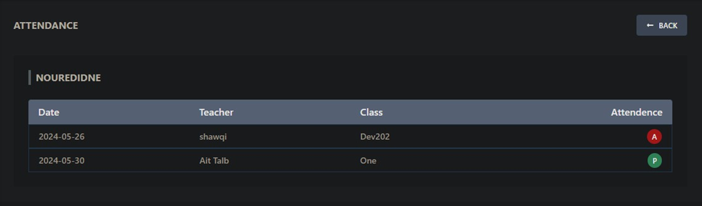
  <p>Child's Attendance Monitoring</p>
  
  <p>Parent Profile</p>
</div>

## 🛠️ Technologies Used

### Backend
- **Framework:** Laravel 9
- **Database:** MySQL
- **Authentication:** Laravel Sanctum
- **API:** RESTful API architecture
- **Caching:** Redis

### Frontend
- **Framework:** Vite.js
- **Styling:** Tailwind CSS, Bootstrap
- **JavaScript:** Alpine.js
- **UI Components:** Custom components
- **Responsive Design:** Mobile-first approach

## 💻 System Requirements

- PHP >= 8.0
- Node.js >= 16
- MySQL >= 5.7
- Composer
- Web server (Apache/Nginx)

## 🚀 Installation

1. Clone the repository
```bash
git clone [repository-url]
```

2. Install PHP dependencies
```bash
composer install
```

3. Install NPM packages
```bash
npm install
```

4. Configure environment variables
```bash
cp .env.example .env
php artisan key:generate
```

5. Set up the database
```bash
php artisan migrate
php artisan db:seed
```

6. Start the development server
```bash
php artisan serve
npm run dev
```

## 📁 Project Structure

- `/app` - Contains the core code of the application
- `/database` - Contains database migrations and seeders
- `/resources` - Contains views, raw assets, and localization files
- `/routes` - Contains all route definitions
- `/tests` - Contains test files
- `/public` - Contains publicly accessible files
- `/redmefiles` - Contains documentation images and reports

## 🧪 Testing

The application includes several types of tests:
- Functional tests
- Usability tests
- Performance tests
- Compatibility tests
- Security tests

Run tests using:
```bash
php artisan test
```

## 🔒 Security

The system implements several security measures:
- Role-based access control
- Secure authentication
- Data encryption
- XSS protection
- CSRF protection
- Input validation
- Session management

## 👨‍💻 Contributors

- **Developers:**
  - Amine IYOUBI
  - Noureddine IHICHR
- **Project Supervisor:**
  - SOUFIANE AIT TALEB

## 🏫 Institution

Institut Spécialisé de Technologie Appliquée Guelmim  
Academic Year: 2023/2024

## 📄 License

[MIT License](LICENSE)